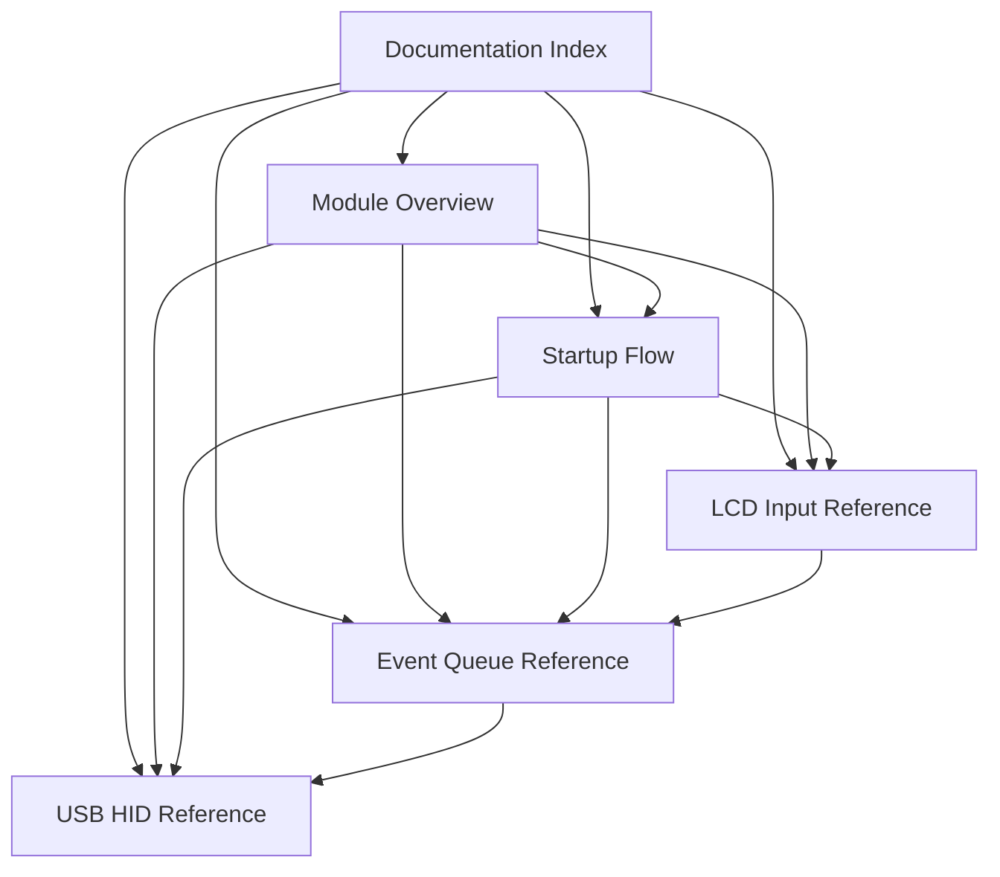

# Documentation Index

This page is the entry point for the repository documentation.

## Reading Guide

| If you want to understand... | Start here |
| --- | --- |
| the overall firmware structure | `module-overview.md` |
| how the firmware boots and enters the runtime loop | `user-guides/startup-flow.md` |
| how LCD button input is handled | `reference/lcd-input.md` |
| how the event queue behaves | `reference/events-queue.md` |
| how USB HID output is generated | `reference/usb-hid.md` |

## Document Map

## Suggested Reading Order

1. Read `module-overview.md` for the architecture.
2. Read `user-guides/startup-flow.md` for control flow.
3. Read the reference documents for subsystem details.