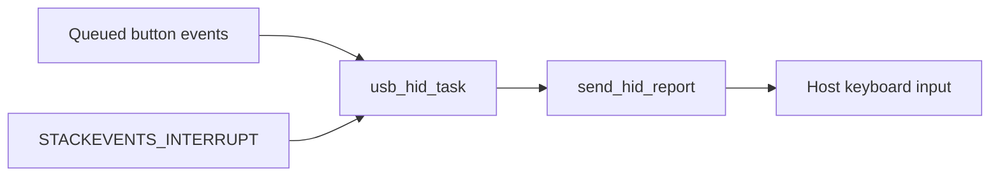
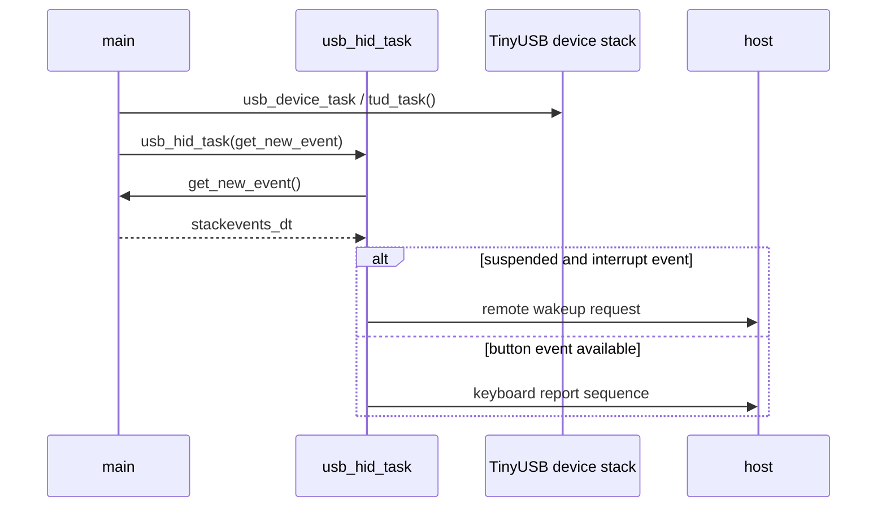
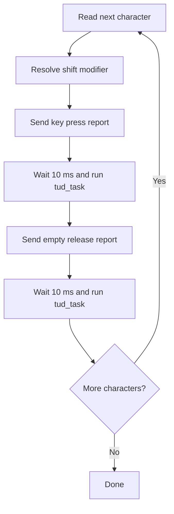

# USB HID Reference

This reference documents the current USB HID implementation in `src/usb/usb.c`.

## Scope

The firmware currently exposes a TinyUSB-based HID keyboard device.
Its behavior is event-driven and tied to the shared event queue managed by the rest of the firmware.

## Public Interface

Declared in `src/usb/usb.h`:

- `int initialize_usb_module();`
- `void usb_device_task();`
- `void usb_hid_task(get_new_event_t func);`
- `const char *usb_event_text(stackevents_dt ev);`

`get_new_event_t` is a function pointer type that returns one `stackevents_dt` value.

## Initialization

`initialize_usb_module()` calls `tud_init(BOARD_TUD_RHPORT)`.

Return values:

- `0` when TinyUSB initialization succeeds
- `-1` when TinyUSB initialization fails

## USB Identity

| Field | Value |
| --- | --- |
| USB version | `0x0110` |
| Vendor ID | `0x1234` |
| Product ID | `0xABCD` |
| Device version | `0x0000` |
| Configurations | `1` |

The current device descriptor uses these values:

- USB version: `0x0110`
- Vendor ID: `0x1234`
- Product ID: `0xABCD`
- Device version: `0x0000`
- Number of configurations: `1`

Current string descriptor behavior:

- language ID: `ja-JP` (`0x411`)
- manufacturer string: `Piraspico`
- product string: `Piraspico`
- serial string: not provided

## HID Report Model

The report descriptor is currently a keyboard-only descriptor:

- `TUD_HID_REPORT_DESC_KEYBOARD(HID_REPORT_ID(REPORT_ID_KEYBOARD))`

The configuration descriptor exposes one HID IN/OUT interface.

## Runtime Tasks

### `usb_device_task()`

Runs `tud_task()`.
This services the core TinyUSB device stack and must be called repeatedly.

### `usb_hid_task(get_new_event_t get_new_event)`

This function polls every 10 ms.
If less than 10 ms has elapsed since the previous eligible poll, it returns immediately.

On each eligible poll:

1. it fetches one event from `get_new_event()`
2. if the device is suspended and the event is `STACKEVENTS_INTERRUPT`, it calls `tud_remote_wakeup()`
3. otherwise it forwards the event to `send_hid_report(REPORT_ID_KEYBOARD, ev)`

## Event-to-Output Mapping

| Event | HID behavior |
| --- | --- |
| `STACKEVENTS_BTN1` | types `mail@example.com` |
| `STACKEVENTS_BTN2` | types `btn2 click!` |
| `STACKEVENTS_BTN3` | types `btn3 click!` |
| `STACKEVENTS_BTN4` | types `btn4 click!` |
| other events | no keyboard text |

The keyboard payloads are centralized in `usb_event_text()`.
`send_hid_report()` asks that helper for the text and only types when the helper returns a non-null pointer.

Current mapping:

- `STACKEVENTS_BTN1` -> `mail@example.com`
- `STACKEVENTS_BTN2` -> `btn2 click!`
- `STACKEVENTS_BTN3` -> `btn3 click!`
- `STACKEVENTS_BTN4` -> `btn4 click!`

Events outside those mappings currently produce no keyboard text.

This includes:

- `STACKEVENTS_NONE`
- `STACKEVENTS_FULL`
- `STACKEVENTS_INTERRUPT`

## String Typing Behavior

`usb_hid_type_string()` sends one character at a time using the ASCII-to-keycode conversion table.

Per character it:

1. resolves whether left shift is needed
2. sends a keyboard report with the keycode
3. waits 10 ms and services `tud_task()`
4. sends an empty keyboard report to release the key
5. waits 10 ms and services `tud_task()` again

This means each character is emitted as a press-and-release pair.

## Constraints and Current Limitations

- Output strings are compile-time constants.
- Only keyboard HID behavior is implemented.
- `tud_hid_get_report_cb()` returns `0` and does not provide custom report data.
- `tud_hid_set_report_cb()` ignores host-sent reports.
- There is no user-configurable keymap layer in the current firmware.

## Integration Contract

The USB layer expects the caller to:

- initialize the shared event system before USB polling begins
- call `usb_device_task()` repeatedly
- call `usb_hid_task()` repeatedly with a valid event supplier callback

The USB layer does not own the event queue. It only consumes one event at a time through the supplied callback.

## Related Documents

- `docs/module-overview.md`
- `docs/user-guides/startup-flow.md`
