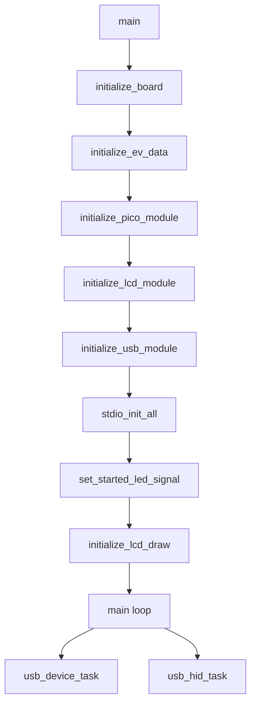
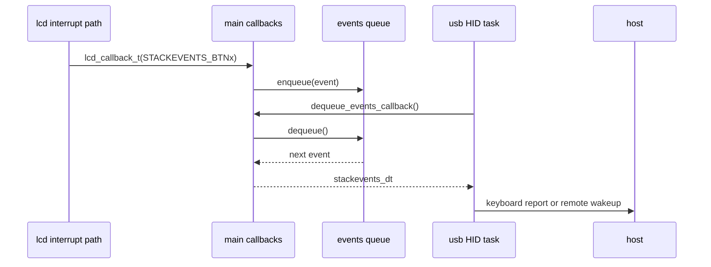

# Startup Flow

This guide describes the current firmware startup and runtime sequence implemented in `src/main.c`.

## Purpose



The firmware boot path is intentionally simple:

1. Prepare shared state.
2. Initialize hardware-facing modules.
3. Start the LCD UI.
4. Enter the USB runtime loop.

This order matters because later modules depend on services created earlier in the sequence.

## Startup Sequence

## Startup Summary

| Step | Function | Purpose | On failure |
| --- | --- | --- | --- |
| 1 | `initialize_ev_data()` | reset shared queue state | startup aborts |
| 2 | `initialize_pico_module()` | prepare LED and board support | startup aborts |
| 3 | `initialize_lcd_module()` | prepare LCD low-level support | startup aborts |
| 4 | `initialize_usb_module()` | start TinyUSB device support | startup aborts |
| 5 | `stdio_init_all()` | enable debug I/O | no explicit failure path |
| 6 | `set_started_led_signal()` | show positive startup state | no explicit failure path |
| 7 | `initialize_lcd_draw()` | start UI and input handling | enters error LED loop |

### 1. `main()` enters the firmware path

In the normal firmware build, `main()` first calls `initialize_board()`.
If board initialization fails, `main()` returns immediately instead of entering the runtime loop.

In host-test builds guarded by `HOST_TEST`, `main()` returns the result of `initialize_board()` and does not run the infinite loop.

### 2. Binary metadata is declared

`initialize_board()` declares binary information metadata through `bi_decl()`.
This is used by Pico tooling and does not affect control flow beyond metadata registration.

### 2.5 Startup status code is derived

`initialize_board()` now uses a small helper to convert individual module return codes into a single startup result.

Current result values:

- `0`: startup preparation succeeded
- `-1`: event queue initialization failed
- `-2`: Pico board support initialization failed
- `-3`: LCD low-level initialization failed
- `-4`: USB initialization failed

The helper reports the first failing stage in startup order.

### 3. Event queue is initialized

`initialize_ev_data()` resets the shared event queue state.
This must happen before any producer can enqueue events or any consumer can dequeue them.

If this step fails, startup aborts.

### 4. Pico board support is initialized

`initialize_pico_module()` sets up the onboard LED support through the Pico board layer.

This enables later status signaling:

- started state through a steady LED
- fatal error state through a repeating blink pattern

If this step fails, startup aborts.

### 5. LCD support is initialized

`initialize_lcd_module()` initializes the Pico-LCD-1.3 support stack.
At this point the low-level LCD support is prepared, but the UI framebuffer and button interrupt path are not yet fully started.

If this step fails, startup aborts.

### 6. USB support is initialized

`initialize_usb_module()` initializes TinyUSB on the configured root hub port.

If this step fails, startup aborts.

### 7. Standard I/O is enabled

After `initialize_board()` succeeds, `main()` calls `stdio_init_all()`.
This enables standard I/O used for debug prints.

### 8. Started LED signal is set

`set_started_led_signal()` turns on the onboard LED.
This is the current positive startup indicator.

### 9. LCD drawing is started

`initialize_lcd_draw(enqueue_events_callback)` completes the LCD/UI startup.
This step:

1. stores the callback used to publish LCD button events
2. allocates the framebuffer
3. draws the splash screen
4. waits briefly
5. draws the menu screen
6. enables GPIO interrupts
7. draws the initial selected item

If this step fails, the firmware enters `set_err_led_signal(2)` and stays in the error blink loop.

## Runtime Loop



After startup succeeds, the firmware runs forever:

1. `usb_device_task()` services the TinyUSB device stack.
2. `usb_hid_task(dequeue_events_callback)` polls for one event and converts it into USB HID behavior.

The loop has no scheduler beyond the per-module logic. Timing-sensitive behavior is handled internally by the USB and GPIO layers.

## Event Path During Runtime

The runtime event path is:

1. LCD button interrupts call the registered LCD callback.
2. `enqueue_events_callback()` pushes the event into the shared queue.
3. The USB HID task asks `dequeue_events_callback()` for the next event.
4. `dequeue_events_callback()` returns `STACKEVENTS_INTERRUPT` when BOOTSEL is pressed, otherwise it returns the next queued event.
5. The USB module either requests remote wakeup or sends keyboard output.

## Failure Model

```mermaid
flowchart TD
	A[Initialization step fails] --> B[initialize_board returns non-zero]
	B --> C[main returns]
	D[initialize_lcd_draw fails] --> E[set_err_led_signal(2)]
	E --> F[infinite blink loop]
	G[queue overflow path] --> H[set_err_led_signal(10)]
	H --> F
```

The current startup flow has two kinds of failure handling:

- early return on initialization failure inside `initialize_board()`
- infinite error LED loop when LCD draw initialization fails or when the queue overflow path escalates to `set_err_led_signal()`

The early-return path now preserves which initialization stage failed through the numeric return code listed above.

There is no recovery path once the firmware enters the error LED loop.

## Related Documents

- `docs/module-overview.md`
- `docs/reference/usb-hid.md`
